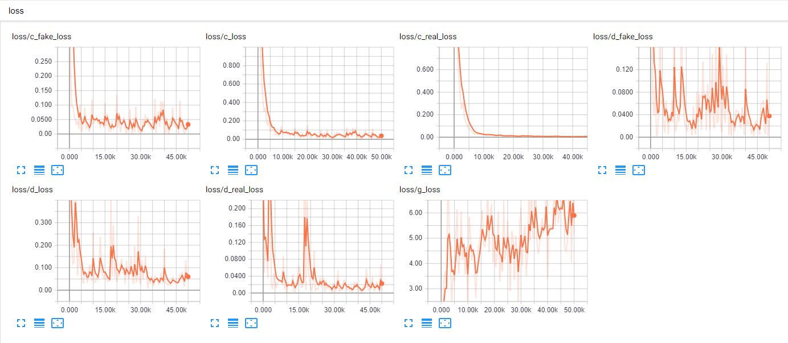

# Auxiliary Classifier Generative Adversarial Networks

## Loss Function

* used ``sce_loss`` with D/G nets
* used ``softce_loss`` with C nets

## Architecture Networks

* Same with the AC-GAN paper.
* But, i just used hyper-parameters like weight initializer, etc...

*DIFFS* | *AC-GAN Paper* | *ME*  |
 :---:  |     :---:      | :---: |
 **weight initializer** | `Isotropic Gaussian` | ``HE Initializer`` |
 **Activation noise std** | ``0 ~ 0.2`` | ``None`` |

> Isotropic Gaussian parameters : (µ = 0, σ = 0.02)  
> HE Initializer parameters     : (factor = 1, FAN_AVG, uniform)

## Tensorboard

## Result

*Name* | *Global Step 10k* | *Global Step 25k* | *Global Step 50k*
:---: | :---: | :---: | :---:
**ACGAN**     |  |  | 

## To-Do
* 