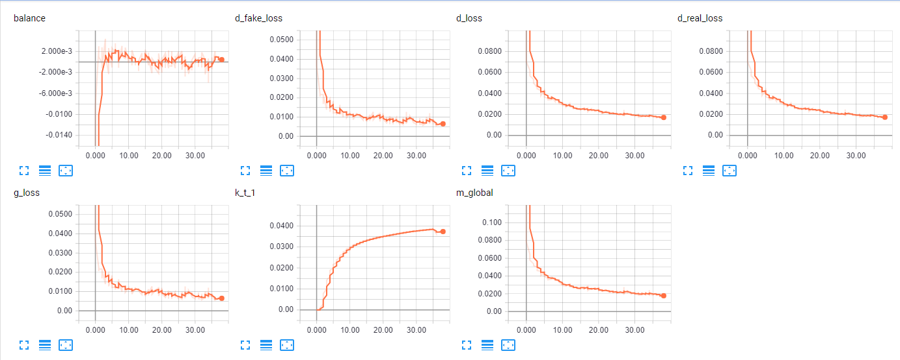
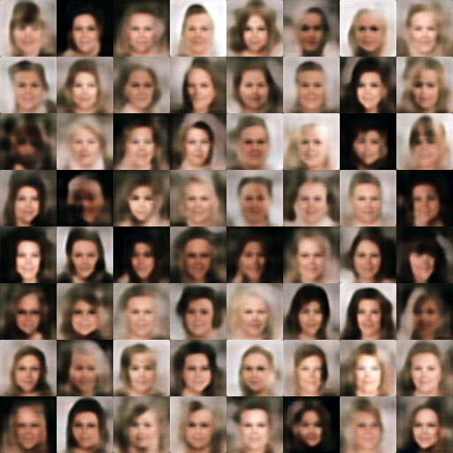
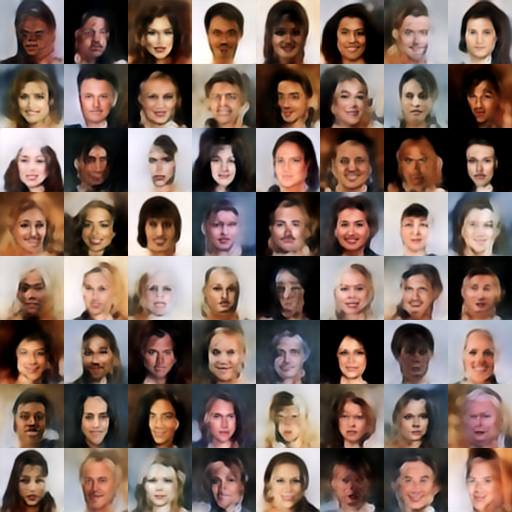

# Boundary Equilibrium Generative Adversarial Networks

## Loss Function

* used ```l1 loss```.

## Architecture Networks

* Same with the BEGAN paper.

*DIFFS* | *BEGAN Paper* | *ME*  |
 :---:  |     :---:      | :---: |
 **image size** | ``128`` | ``64`` |
 **skip connection** | ``suggested but not used`` | ``used`` |
 
## Tensorboard



> Elapsed time : 28800s with ``GTX 1080 8GB x 1``

## Result

*Name* | *Global Step 50k* | *Global Step 100k* | *Global Step 300k*
:---: | :---: | :---: | :---:
**BEGAN**     |  |  | 

## To-Do
* 
