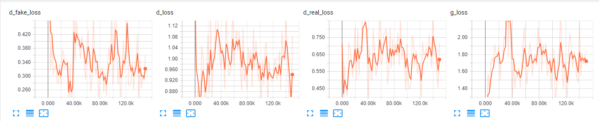
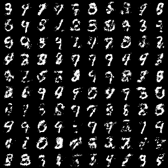
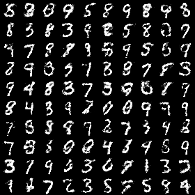
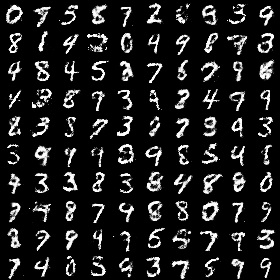

# Boundary Seeking Generative Adversarial Networks

## Loss Function

* used ``GAN loss`` at D net
* used ``L2 loss`` at G net

## Architecture Networks

* just 2 fc layers network for D/G nets
* In original BGAN paper, using simple 4 conv layers * 3 fc layers

## Tensorboard

> Elapsed time : 920s with ``GTX 1060 6GB x 1``

## Result

*Name* | *Global Step 50k* | *Global Step 100k* | *Global Step 200k*
:---: | :---: | :---: | :---:
**BGAN**      |  |  | 

## To-Do
* Add KL/Reverse-KL divergence
* Add JS divergence
* Add f-divergence
* Add Reinforce-based BGAN
* Add Squared-Hellinger

