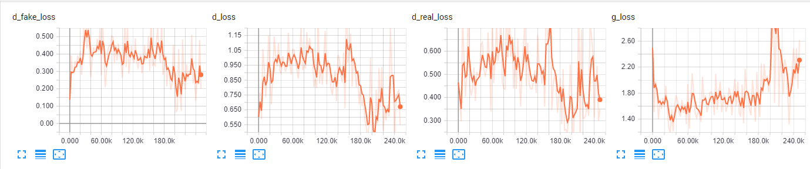
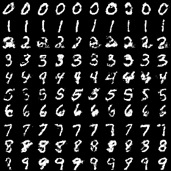
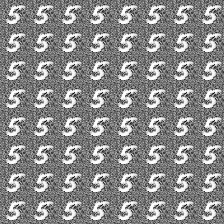

# Conditional Generative Adversarial Networks

## Loss Function

* used ``Vanilla GAN loss`` at D/G nets.
* used ``sce loss`` at D/G nets.

## Architecture Networks

* Similar as CGAN paper

*DIFFS* | *CGAN Paper* | *ME*  |
 :---:  |     :---:      | :---: |
 **G net FC Units** | `[200, 1000]` | ``[256, 1024]`` |
 **LR** | ``1e-1`` | ``8e-4`` |
 **LR Decay** | ``exponential decay`` | ``None`` |
 **momentum** | ``.5 to .7`` | ``None`` |
 
> Learning Rate : 1e-1 ~ to 1e-6, factor = 1 + 4e-5  
> HE Initializer parameters     : (factor = 1, FAN_AVG, uniform)

## Tensorboard

> Elapsed Time : 3070s with ``GTX 1060 6GB x 1``

## Result

*Name* | *Global Step 50k* | *Global Step 100k* | *Global Step 200k*
:---: | :---: | :---: | :---:
**CGAN**      |  |  | 

## To-Do
* 