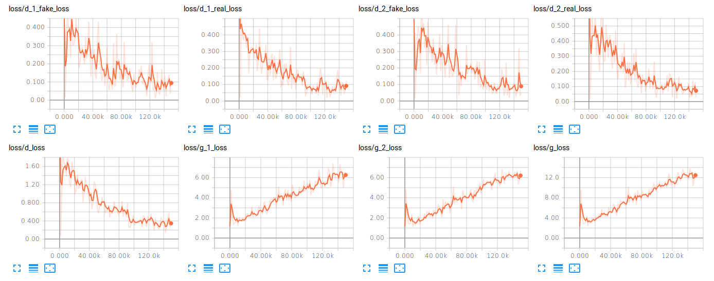

# Coupled Generative Adversarial Networks

## Loss Function

* used ``sce loss`` at D/G nets.

## Architecture Networks

* Similar as CoGAN paper.

*DIFFS* | *CoGAN Paper* | *ME*  |
 :---:  |     :---:      | :---: |
 **Pooling** | ``max_pooling2d`` | ``conv2d pooling`` |
 
> Learning Rate : 1e-1 ~ to 1e-6, factor = 1 + 4e-5  
> HE Initializer parameters     : (factor = 1, FAN_AVG, uniform)

## Tensorboard

> Elapsed Time : s with ``GTX 1060 6GB x 1``

## Result

*Name* | *Global Step 50k* | *Global Step 100k* | *Global Step 200k*
:---: | :---: | :---: | :---:
**Gen 1**      |  |  | 
**Gen 2**      |  |  | 

## To-Do
* 