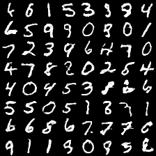

# Coupled Generative Adversarial Networks

## Loss Function

* used ``sce loss`` at D/G nets.

## Architecture Networks

* Same as CoGAN paper.

*DIFFS* | *CoGAN Paper* | *ME*  |
 :---:  |     :---:      | :---: |
 **Pooling** | ``max_pooling2d`` | ``conv2d pooling`` |
 **G net**   | ``5 fc layers``   | ``2 fc + 3 deconv2d layers`` |
 **conv2d filters** | ``D[20, 50]`` | ``D[32, 64]`` |
 **fc units** | ``D[500]`` | ``D[512]`` |

> HE Initializer parameters     : (factor = 1, FAN_AVG, uniform)

## Tensorboard

> Elapsed Time : s with ``GTX 1060 6GB x 1``

## Result

*Name* | *Global Step 2.5k* | *Global Step 5k* | *Global Step 12.5k*
:---: | :---: | :---: | :---:
**Gen 1 (original)**      |  |  | 
**Gen 2 (90° rotated)**    |  |  | 

## To-Do
* 