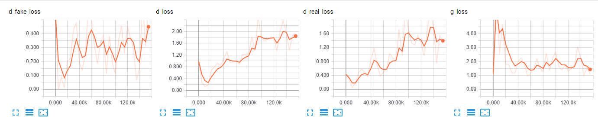

# Deep Convolutional Generative Adversarial Networks

## Loss Function

* used ``sce loss`` at D/G nets.

## Architecture Networks

* Same as DCGAN paper.

*DIFFS* | *DCGAN Paper* | *ME*  |
 :---:  |     :---:      | :---: |
 **Weight initializer** | ``normal dist`` | ``HE initializer`` |
 **z noise** | ``100`` | ``128`` |

> Normal Distribution Initializer : (µ = 0, σ = 0.02)  
> HE Initializer parameters       : (factor = 1, FAN_AVG, uniform)

## Tensorboard

> Elapsed Time : s with ``GTX 1060 6GB x 1``

## Result

*Name* | *Global Step 5k* | *Global Step 10k* | *Global Step 25k*
:---: | :---: | :---: | :---:
**DCGAN**      |  |  | 

## To-Do
* 