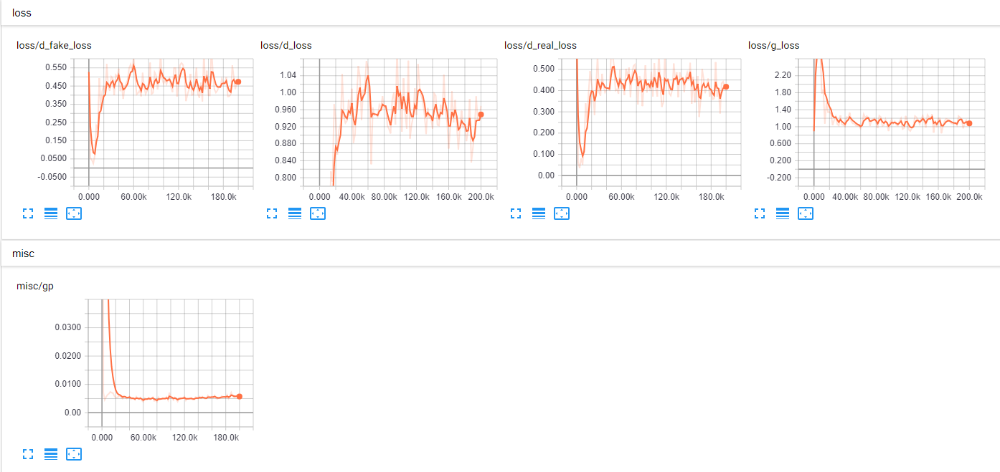
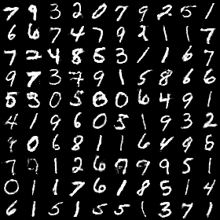

# On Convergence and Stability of Generative Adversarial Networks

## Loss Function

* used ``sce loss`` at D/G nets.

## Architecture Networks

* Same as DRAGAN paper.

*DIFFS* | *DRAGAN Paper* | *ME*  |
 :---:  |     :---:      | :---: |
 **Weight initializer** | ``xavier initializer`` | ``HE initializer`` |
 **z noise** | ``100`` | ``128`` |
 **image scale** | ``-1,1`` | ``0,1`` |
 
> HE Initializer parameters       : (factor = 1, FAN_AVG, uniform)

## Tensorboard

> Elapsed Time : s with ``GTX 1060 6GB x 1``

## Result

*Name* | *Global Step 50k* | *Global Step 100k* | *Global Step 200k*
:---: | :---: | :---: | :---:
**DRAGAN**      |  |  | 

## To-Do
* 