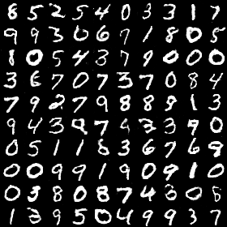
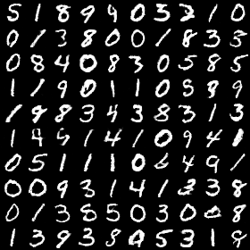

# Energy-based Generative Adversarial Networks

## Loss Function

* used ``mse loss`` at D net
* used ``mse_loss / pt_loss`` at G net

## Architecture Networks

* same as EBGAN paper

## Tensorboard

## Result

*Name* | *Global Step 50k* | *Global Step 100k* | *Global Step 200k*
:---: | :---: | :---: | :---:
**EBGAN**     |  |  | 

## To-Do
*
