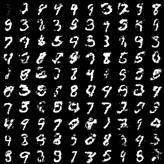
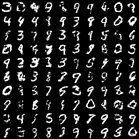

# Generative Adversarial Networks

## Loss Function

* used ``softmax GAN loss`` at D/G nets
* uncomment ``GAN loss`` if you want to use

## Architecture Networks

* just simple 2 fc layers

## Tensorboard

## Result

*Name* | *Global Step 50k*  | *Global Step 100k* | *Global Step 200k*
:---: | :---: | :---: | :---:
**GAN**       |  |  | 

## To-Do
* 