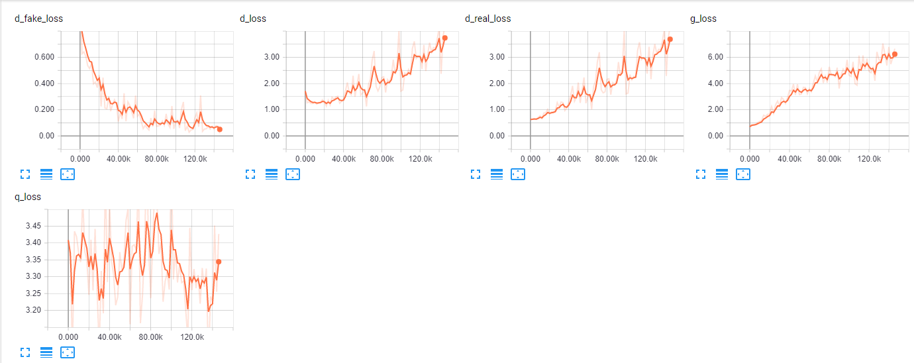
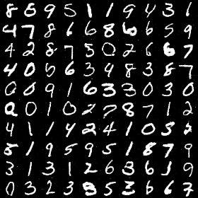

# Information Maximizing Generative Adversarial Networks

## Loss Function

* used ``sce loss`` at D/G nets.

## Architecture Networks

* Same with the InfoGAN paper.

*DIFFS* | *InfoGAN Paper* | *ME*  |
 :---:  |     :---:      | :---: |
 **asdf** | `` `` | `` `` |

## Tensorboard

> Elapsed time : s with ``GTX 1060 6GB x 1``

## Result

*Name* | *Global Step 20k* | *Global Step 50k* | *Global Step 100k*
:---: | :---: | :---: | :---:
**InfoGAN**   |  |  | 

## To-Do
* 
