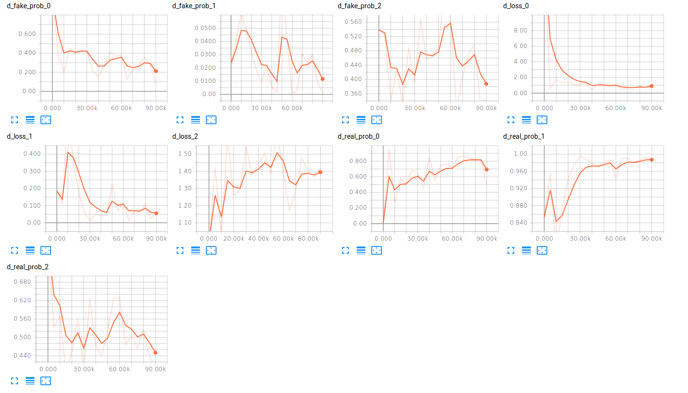
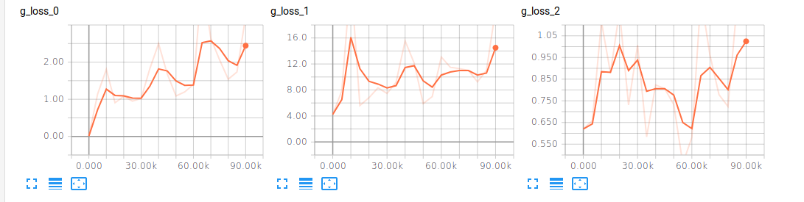

# Laplacian Pyramid Generative Adversarial Networks

## Loss Function

* Using ```sce loss``` for G/D nets.

## Architecture Networks

* Similar as LAPGAN paper.

*DIFFS* | *DCGAN Paper* | *ME*  |
 :---:  |     :---:      | :---: |
 **Weight initializer** | ``normal dist`` | ``HE initializer`` |
 **z noise** | ``100`` | ``128`` |
 **fc units** | ``D[600], G[1200]`` | ``D[512], G[1024]``
 **image size** | ``28x28 for cifar-10`` | ``32x32 for cifar-10`` |
 **Optimizer** | ``SGD`` | ``Adam`` |
 **LR** | ``2e-2`` | ``8e-4`` |
 **LR Decay** | ``exponential decay`` | ``None`` |
 **momentum** | ``.5 to .8`` | ``None`` |

> Momentum Increasing by 8e-4. <br/>
> Learning Rate : 2e-2 factor = 1 + 4e-5 <br/>
> Normal Distribution Initializer : (µ = 0, σ = 0.02) <br/>
> HE Initializer parameters       : (factor = 1, FAN_AVG, uniform)

## Tensorboard

* Discriminator



* Generator



> Elapsed time : s with ``GTX 1060 6GB x 1``

## Result

*Name* | *Global Step 50k* | *Global Step 100k* | *Global Step 150k*
:---: | :---: | :---: | :---:
**LAPGAN**    |  |  | 

## To-Do
* 
