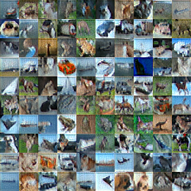
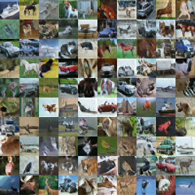
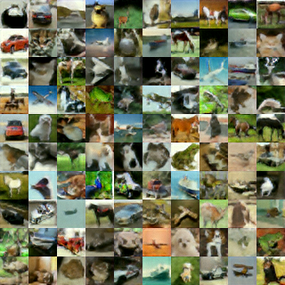

# Laplacian Pyramid Generative Adversarial Networks

## Loss Function

* Using ```sce loss``` for G/D nets.

## Architecture Networks

* Similar as LAPGAN paper.

## Tensorboard

* Discriminator


* Generator


> Elapsed time : s with ``GTX 1060 6GB x 1``

## Result

*Name* | *Global Step 10k* | *Global Step 50k* | *Global Step 100k*
:---: | :---: | :---: | :---:
**LAPGAN**    |  |  | 

## To-Do
* 
