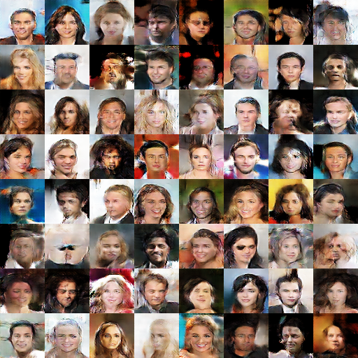
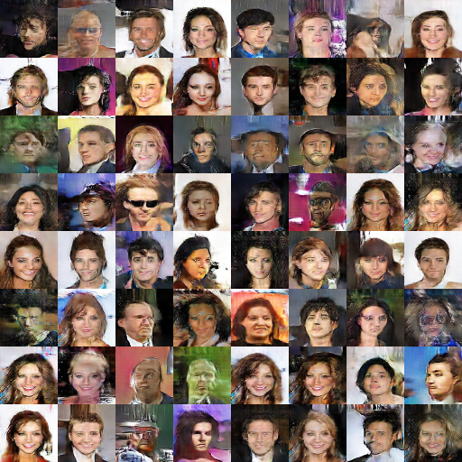

# Mode Regularized Generative Adversarial Networks

## Loss Function

* used ``GAN + (Enc) loss`` at D/G nets.
* used ``Adv + MSE loss`` at Encoder.

## Architecture Networks

* Same as MRGAN paper.

*DIFFS* | *MRGAN Paper* | *ME*  |
 :---:  |     :---:      | :---: |
 **Weight initializer** | ``normal dist`` | ``HE initializer`` |
 **z dim** | ``100`` | ``128`` |
  
> HE Initializer parameters       : (factor = 1, FAN_AVG, uniform)

## Tensorboard

> Elapsed Time : 5h 18m s with ``GTX 1060 6GB x 1``

## Result

*Name* | *Global Step 8k* | *Global Step 16k* | *Global Step 32k*
:---: | :---: | :---: | :---:
**MRGAN**      |  |  | 

## To-Do
* 