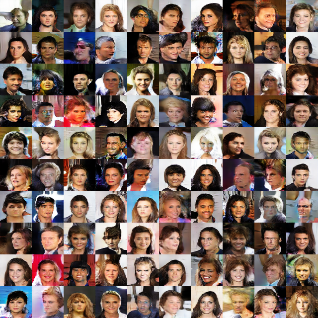

# Self-Attention Generative Adversarial Networks

## Loss Function

* used ``hinge loss`` with D/G nets.

## Architecture Networks

* Same with the SAGAN paper.

*DIFFS* | *SAGAN Paper* | *ME*  |
 :---:  |     :---:     | :---: |
 **image size** | ``128`` | ``64`` |

> I just reduce image size from 128 to 64 because of my gpu memory...  
> you can just change image size back to 128.  
> (even using image size 64, additional memory is needed :(. Over GTX 1080 is recommended!)

## Tensorboard

> Elapsed Time : 3 hour 42 minute 18s with ``GTX 1060 6GB x 1``

## Result

*Name* | *Global Step 10k* | *Global Step 20k* | *Global Step 30k*
:---: | :---: | :---: | :---:
**SAGAN**     |  |  | 

## To-Do
* 
