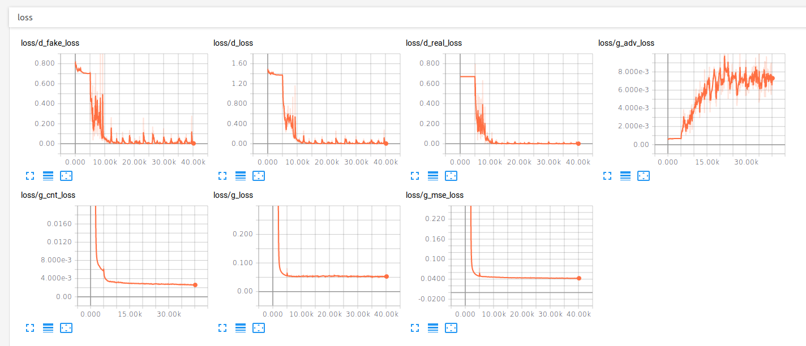
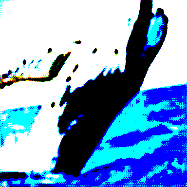

# Super-Resolution Generative Adversarial Networks

## Loss Function

* For ``Gen loss``

1. VGG19 BottleNeck feature loss (content loss)
2. [optional] MSE loss (content loss)
3. Adversarial GAN loss with sigmoid

* For ``Disc loss``

1. Adversarial GAN loss with sigmoid

## Architecture Networks

* Same as SRGAN paper

*DIFFS* | *SRGAN Paper* | *ME*  |
 :---:  |     :---:      | :---: |
 **Weight initializer** | ``normal dist`` | ``HE initializer`` |
 **content loss scaling** | ``1 / 12.75`` | ``3e-6`` |
 **image scaling** | ``lr[0,1] hr[-1,1]`` | ``[-1,1]`` |

## Tensorboard

> Elapsed time : s with ``GTX Titan X 12GB x 1 (maxwell)``

## Result

*Name* | *Valid HR image* | *Global Step 1k* | *Global Step 40k*
:---: | :---: | :---: | :---:
**SRGAN**  |  |  | 

## To-Do
* 
