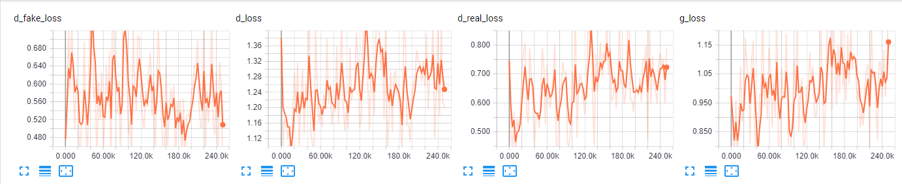
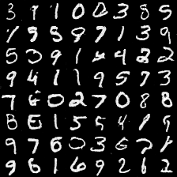
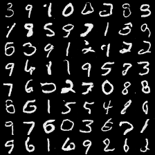

# Wasserstein Generative Adversarial Networks

## Loss Function

* used ``sce loss`` at D/G nets.
* used ``gradient penalty``

## Architecture Networks

* slightly different as in the **WGAN paper**.

## Tensorboard

> Elapsed time : s with ``GTX 1060 6GB x 1``

## Result

*Name* | *Global Step 50k* | *Global Step 100k* | *Global Step 200k*
:---: | :---: | :---: | :---:
**WGAN-GP**   |  |  | 

## To-Do
*