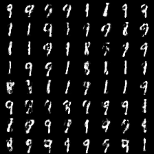
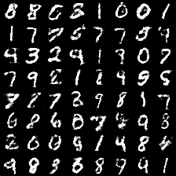

# Training Generative Neural Samplers using Variational Divergence Minimization

## Loss Function

* used ``f-divergences familiy`` at D/G nets.

## Architecture Networks

* Same as f-GAN paper.

*DIFFS* | *f-GAN Paper* | *ME*  |
 :---:  |     :---:      | :---: |
 **Weight initializer** | ``normal dist`` | ``HE initializer`` |
 **z dim** | ``100`` | ``128`` |
 **fc unit** | ``D/G[240,1200]`` | ``D/G[256,1024]`` |
 **img scaling** | ``-1,1`` | ``0,1`` |
 
> Normal Distribution Initializer : (µ = 0, σ = D/G(0.005,0.05))  
> HE Initializer parameters       : (factor = 1, FAN_AVG, uniform)

## Tensorboard

*Name* | *graph*
:---: | :---:
**GAN** | 
**KL** | 
**Reverse-KL** | 
**JS** | 
**JS-Weighted** | 
**Squared-hellinger** | 
**Pearson** | 
**Neyman** | 
**Jeffrey** | 
**Total-Variation** | 

> Elapsed time : about 20m with ``GTX 1060 6GB x 1``

## Result

*Name* | *Global Step 5k* | *Global Step 10k* | *Global Step 20k*
:---: | :---: | :---: | :---:
**f-GAN (GAN)**                |  |  | 
**f-GAN (KL)**                 |  |  | 
**f-GAN (Reverse-KL)**         |  |  | 
**f-GAN (JS)**                 |  |  | 
**f-GAN (JS-Weighted)**        |  |  | 
**f-GAN (Squared-Hellinger)**  |  |  | 
**f-GAN (Pearson)**            |  |  | 
**f-GAN (Neyman)**             |  |  | 
**f-GAN (Jeffrey)**            |  |  | 
**f-GAN (Total-Variation)**    |  |  | 

> GAN with ``Reverse-KL divergence`` seems like *model-collapsed*. But after `10k steps`, it just works well.

## To-Do
* Add f-divergences
  * GAN - **done**
  * KL - **done**
  * Reverse-KL - **done**
  * JS - **done**
  * JS-Weighted - **done**
  * Squared-Hellinger - **done**
  * Pearson χ^2 - **done**
  * Neyman χ^2 - **done**
  * Jeffrey - **done**
  * Total-Variation - **done**
* Add α-divergences
  * α-divergence (α < 0, α is not 0)
  * α-divergence (α > 1)