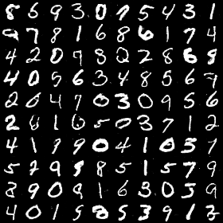
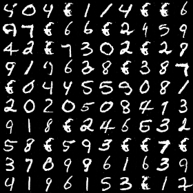

# Information Maximizing Generative Adversarial Networks

## Loss Function

* used ``GAN loss`` at D/G nets.

## Architecture Networks

* Same with the InfoGAN paper.

*DIFFS* | *InfoGAN Paper* | *ME*  |
 :---:  |     :---:      | :---: |
 **G fc units** | ``2 * 2 * 448`` | ``2 * 2 * 512`` |

## Tensorboard

> Elapsed time : s with ``GTX 1080 8GB x 1``

## Result

*Name* | *Global Step 20k* | *Global Step 50k* | *Global Step 100k*
:---: | :---: | :---: | :---:
**InfoGAN**   |  |  | 

## To-Do
* MemoryError... I dunno why :(
