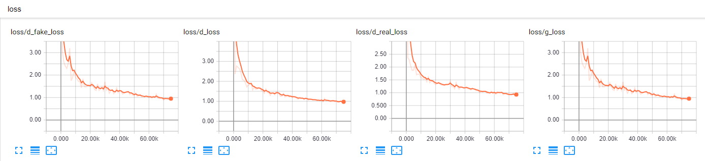
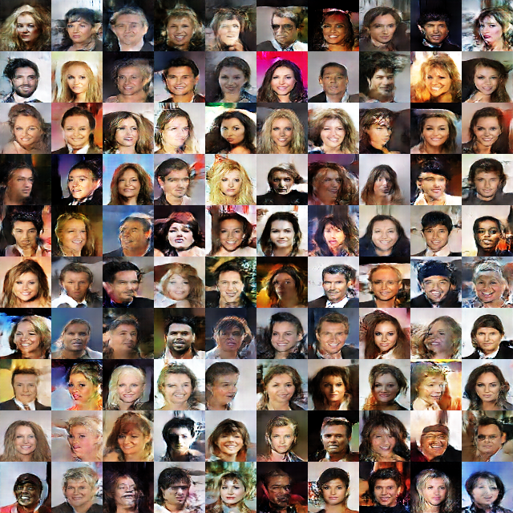

# Margin Adaptation Generative Adversarial Networks

## Loss Function

* used ``mse loss`` at D/G nets.

## Architecture Networks

* Same as MAGAN paper.

*DIFFS* | *MAGAN Paper* | *ME*  |
 :---:  |     :---:      | :---: |
 **Weight initializer** | ``normal dist`` | ``HE initializer`` |
 **z noise (MNIST)** | ``50`` | `` `` |
 **z noise (cifar-10)** | ``320`` | `` `` |
  
> HE Initializer parameters       : (factor = 1, FAN_AVG, uniform)

## Tensorboard

> Elapsed Time : 5h 45m 51s with ``GTX 1060 6GB x 1``

## Result

*Name* | *Global Step 25k* | *Global Step 50k* | *Global Step 75k*
:---: | :---: | :---: | :---:
**MAGAN**      |  |  | 

> Initial pre-trained margin value : about 3.0585415484215974

## To-Do
* 