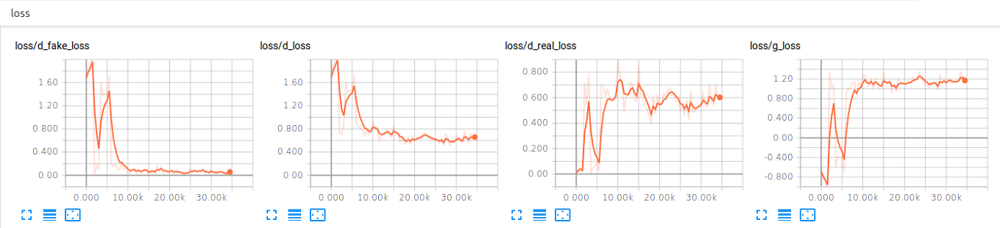
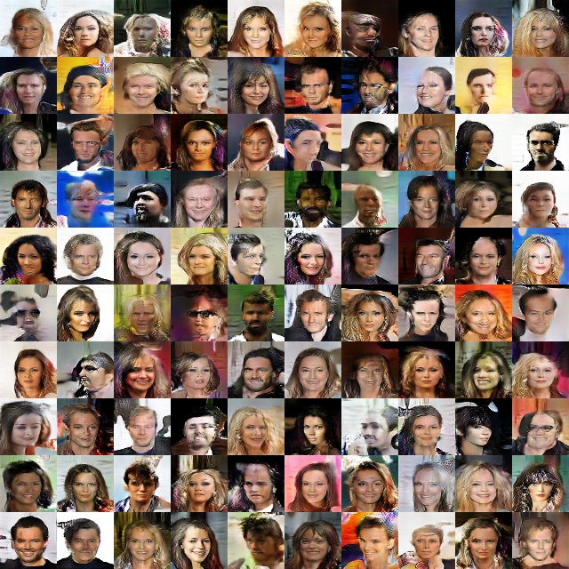
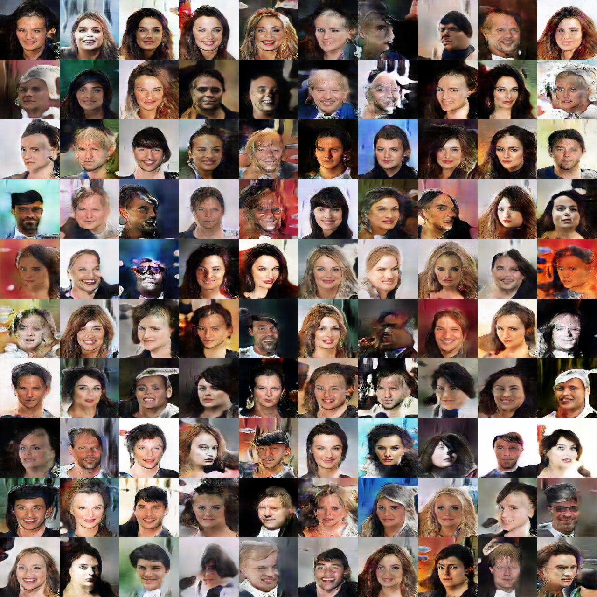

# Self-Attention Generative Adversarial Networks

## Loss Function

* used ``hinge loss`` with D/G nets.

## Architecture Networks

* similar with the SAGAN paper.

* use *batch norm* instead of *conditional batch norm* referred in SAGAN paper.

> (even using image size 64, additional memory is needed :(. Over GTX 1080 is recommended!)

## Tensorboard

> Elapsed Time (64x64) : 3h 42m 18s with ``GTX 1060 6GB x 1``

> Elapsed Time (128x128) : 7h 55m 40s with ``GTX 1080 8GB x 1``

## Result

*Name* | *Global Step 10k* | *Global Step 20k* | *Global Step 30k*
:---: | :---: | :---: | :---:
**SAGAN (64x64)**     |  |  | 
**SAGAN (128x128)**   |  |  | 

## To-Do
* 
