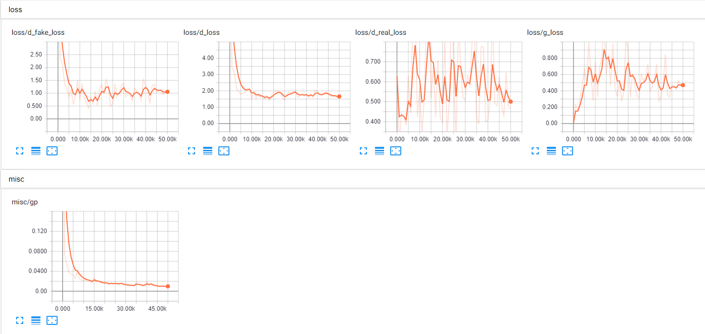
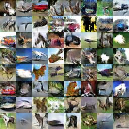

# Wasserstein Generative Adversarial Networks

## Loss Function

* used ``sce loss`` at D/G nets.
* used ``gradient penalty``

## Architecture Networks

* Same with the WGAN paper.

*DIFFS* | *WGAN Paper* | *ME*  |
 :---:  |     :---:    | :---: |
 **Networks** | ``Resnet like`` | ``simple 4 conv nets`` |

## Tensorboard

> Elapsed time : 1h 7m 7s with ``GTX 1060 6GB x 1``

## Result

*Name* | *Global Step 10k* | *Global Step 25k* | *Global Step 50k*
:---: | :---: | :---: | :---:
**WGAN-GP**   |  |  | 

## To-Do
*