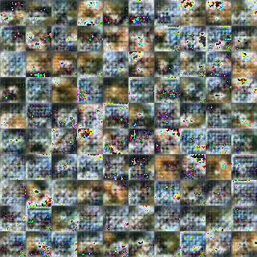
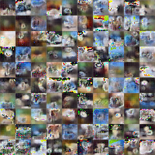

# Wasserstein Generative Adversarial Networks

## Train

```shell script
$ cd Awesome-GANs
$ python3 -m awesome_gans.wgan [parameters...]
```

### Train on CIFAR10/100

```shell script
$ cd Awesome-GANs
$ python3 -m awesome_gans.wgan --width 32 --height 32 --n_channels 3 --dataset 'cifar10'
```

### Train on MNIST

```shell script
$ cd Awesome-GANs
$ python3 -m awesome_gans.wgan --width 28 --height 28 --n_channels 1 --dataset 'mnist'
```

## Architecture Networks

* Same with the `WGAN` paper.

| *Difference* | *Paper* | *Mine*  |
|  :---:  |     :---:    | :---: |
|  **Networks** | ``ResNet like`` | ``simple 4 conv nets`` |

## Result

*Name* | *Epoch 1* | *Epoch 20* | *Epoch 1 ~ 35* |
:---: | :---: | :---: | :---: |
**WGAN**   |  |  |  |

## Useful References
